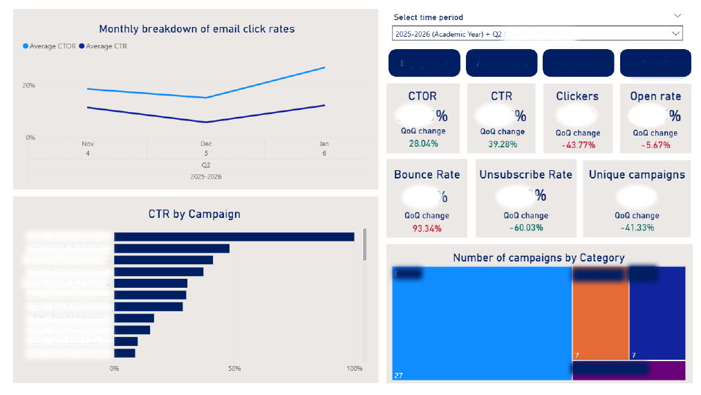

# Campaign Analytics Power BI Report

## Overview
Power BI report for analysing campaign performance across email and social media channels.

> **Note**: All institutional-specific details have been anonymised. 
> Code patterns and logic are generic and applicable to any email campaign analytics workflow.

## Dashboard Preview

### Key Features

**Performance Metrics:**
- **CTOR & CTR**: Click-to-open rate and click-through rate with trend analysis
- **Engagement tracking**: Unique clickers and open rates
- **Quality metrics**: Bounce rate and unsubscribe rate monitoring

**Time Intelligence:**
- Quarter-over-Quarter (QoQ) and Year-over-Year (YoY) percentage changes for all metrics
- Monthly trend breakdowns
- Academic year and quarter filtering

**Campaign Analysis:**
- Performance by individual campaign
- Category breakdown (Events, Alumni Newsletters, Administrative, Appeals)
- Campaign volume tracking

## Project Structure

### Power Query Transformations (`power-query/`)

## About
Power Query (M) and DAX transformations for cleaning and modeling email campaign data 
in Power BI. Created to practice Git/GitHub workflow and demonstrate data transformation skills.

## Data Model Changes
- Created dim_Campaign dimension table
- Standardised campaign names using key matching
- Established relationships via Campaign ID

## Queries

### Power Query Transformations (`power-query/`)

**Dimension Tables:**
- `dim_campaign.m` - Campaign dimension with standardised keys and categories
- `dim_person.m` - Person dimension

**Fact Tables:**
- `fact_campaign.m` - Campaign-level performance metrics
- `fact_email_clicks.m` - Individual click-level tracking
- `fact_social_media.m` - Social media engagement data

**Staging & Utilities:**
- `stg_email_clicks.m` - Email clicks staging transformation
- `row_count_check.m` - Data validation checks

*All `.m` files are Power Query (M language) transformations located in the `power-query/` folder.*

### DAX (`dax/`)

**Calculated Tables:**
- `Dates.dax` - Date dimension with year, month, quarter, and weekday attributes

**Measures:**
- `measures.dax` - Campaign analytics measures including:
  - Base metrics (campaigns, delivered, opened, clicked, bounced, unsubscribed, unique clickers)
  - Performance rates (delivery rate, open rate, CTR, CTOR, bounce rate, unsubscribe rate)
  - Time intelligence (QoQ and YoY % changes for all key metrics)

*All `.dax` files contain DAX formulas for Power BI data model.*

## Key Metrics Explained

| Metric | Definition | Business Value |
|--------|------------|----------------|
| **CTOR** | Click-to-Open Rate: % of email openers who clicked | Measures content relevance and call-to-action effectiveness |
| **CTR** | Click-Through Rate: % of delivered emails clicked | Overall campaign engagement indicator |
| **Open Rate** | % of delivered emails opened | Subject line and sender reputation effectiveness |
| **Bounce Rate** | % of sent emails that bounced | Email list quality indicator |
| **Unsubscribe Rate** | % of delivered emails resulting in unsubscribe | Content relevance and frequency appropriateness |
| **Unique Clickers** | Distinct count of recipients who clicked | Actual audience reach |

## Technologies Used

- **Power BI Desktop** - Data visualization and dashboard
- **Power Query (M)** - ETL and data transformation
- **DAX** - Calculated measures and time intelligence
- **SQL Server** - Source data extraction

## Configuration Required

Before running, create a `Config.pq` file with:
- `ServerName`: Your SQL Server address
- `DatabaseName`: Target database name
- `ExcludeKeywords`: List of campaign keywords to filter out
- `NewCustomerKeywords`: Keywords identifying new customer campaigns
- `CampaignPrefix`: Campaign naming prefix